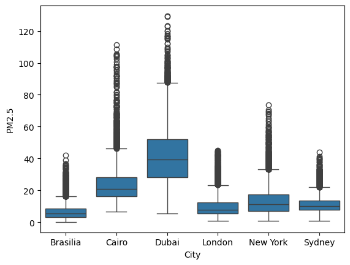
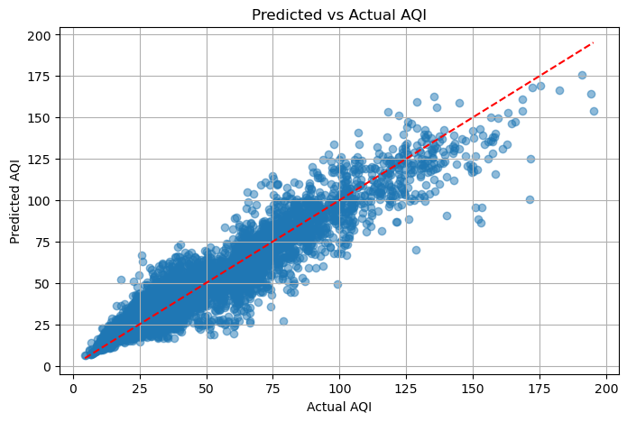
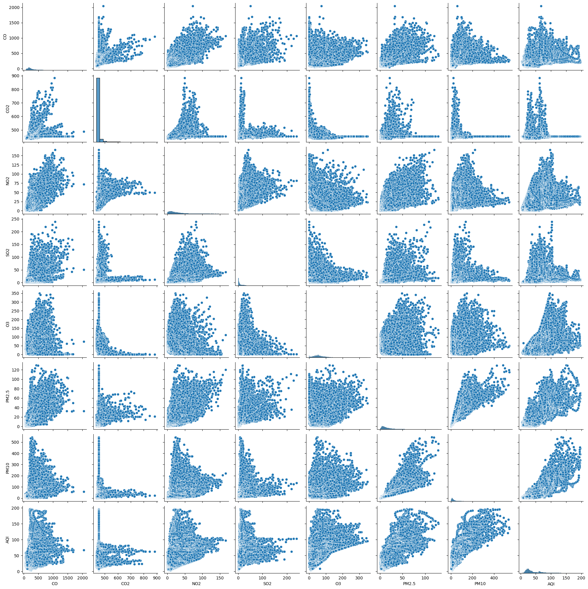
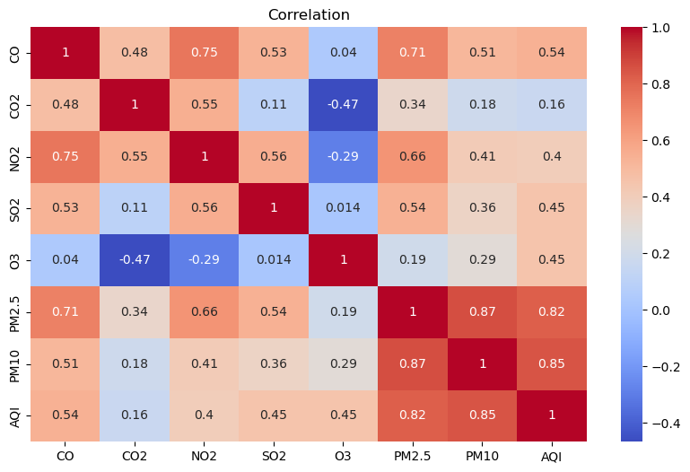

# Global Air Quality (2024) Analysis

This project presents a data analysis of air quality across 6 major global cities in the year 2024.  
The analysis is conducted using Python in a Jupyter Notebook and is based on real-world air quality measurements.

## Project Overview

Air pollution causes around 7 million premature deaths annually (WHO).  
This project investigates:

- Variations in air quality across cities and months  
- PM2.5 and PM10 trends  
- Pollution levels during specific time periods  
- City-by-city comparisons to highlight pollution disparities  
- Feature correlation with AQI  
- Machine learning to predict AQI  

## Dataset

- **Source**: [Kaggle – Global Air Quality (2024)](https://www.kaggle.com/datasets/youssefelebiary/air-quality-2024)  
- **Cities Analyzed**: London, Delhi, Sydney, Dubai, Cairo, Brasília  
- **Records**: 52,000+  
- **Parameters Tracked**:
  - PM2.5  
  - PM10  
  - CO  
  - CO₂  
  - NO₂  
  - SO₂  
  - O₃  
  - AQI (European Standard)

## Tools & Libraries

- Python  
- Pandas, NumPy  
- Matplotlib, Seaborn, Plotly  
- Scikit-learn  
- Jupyter Notebook  

## Visualizations

### PM2.5 Distribution by City

This boxplot shows the distribution of PM2.5 values in each city.  
- **Dubai** exhibits the highest median and extreme outliers, indicating severe air quality issues.  
- **Brasilia** and **London** have significantly lower PM2.5 levels on average.

---

### Predicted vs Actual AQI (Random Forest)

This scatter plot compares predicted AQI values against actual AQI.  
- The closer the points are to the red dashed line, the better the model's predictions.  
- The model performs well overall, though some under/over-predictions occur at higher AQI values.

---

### Pairwise Relationships

This pairplot visualizes relationships between pollutants and AQI.  
- Diagonal plots show individual distributions.  
- Several pollutants like **PM2.5**, **PM10**, and **NO₂** appear strongly related to AQI.

---

### Correlation Heatmap

This heatmap shows how pollutants correlate with AQI and each other.  
- **PM10** (0.85), **PM2.5** (0.82), and **NO₂** (0.40) show strong positive correlation with AQI.  
- **O₃** and **CO₂** show low or negative correlation.

---

## Machine Learning Results

| Model              | R² Score | MAE   | RMSE  |
|-------------------|----------|-------|-------|
| Linear Regression | 0.62     | 15.3  | 19.7  |
| Random Forest     | 0.88     | 7.2   | 10.1  |
| Decision Tree     | 0.80     | 9.4   | 12.5  |

 **Random Forest Regressor** performed best overall in predicting AQI.

## Author

**Eliza Febriana**  

